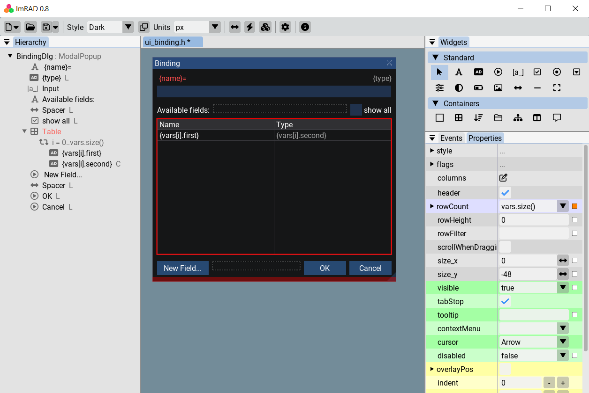

# ImRAD

ImRAD is a GUI builder for the ImGui library. It currently generates and parses C++ code. 

ImRAD runs on Windows and Linux. 

# Features
ImRAD is under development but these are the main features:
* supports wide range of widgets (WIP)
* generates layout using SameLine/Spacing/NextColumn/BeginGroup so widgets stay responsible to window size changes 
* supports property binding. Class variables can be managed through simple class wizard or from binding dialog
* supports generating event handlers
* generated code is delimited by comment markers and user is free to add additional code around and continue to use ImRAD at the same time
* generated code is ready to use in your project and depends only on ImGui library and one accompanying header file  

# License
* ImRAD source code is licensed under the GPL license 
* Any code generated by the tool is excluded from GPL and can be included in any project either open-source or commercial and it's up to the user to decide the license for it. 
* Additionally since imrad.h is used by the generated code it is also excluded from the GPL license  

# Download binaries

[Releases](https://github.com/tpecholt/imrad/releases)

# Screenshots

